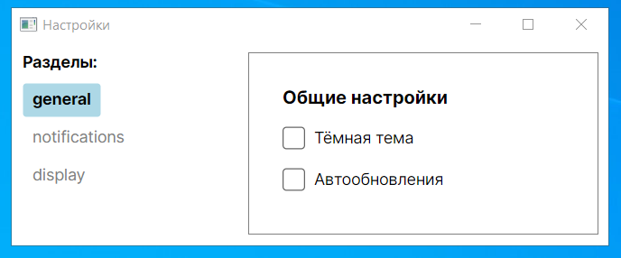
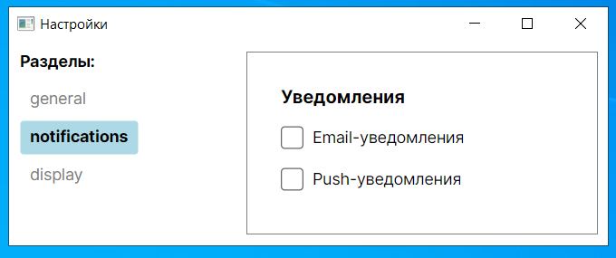
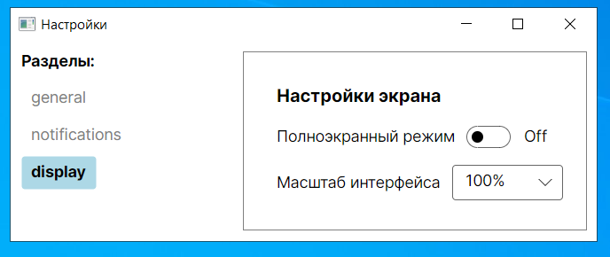

Данная программа реализует окно настроек с несколькими разделами

При нажатии на кнопку раздела происходит навигация к соответствующему разделу, а выбранная кнопка визуально выделяется

Этот пример сделан для тренировки написания программ с роутингом, в котором используется IScreen, IRoutableViewModel и RoutingState

В проекте используется ViewLocator

В MainWindow.ahaml описаны стили для выбранной и не выбранной кнопки

Для сопоставления используется BoolToClassNameConverter

